# deepASLearning

Actively working project. 

Deploy deep learning technologies in computer vision to bridge the communication gap between the deaf and everyone else. This project contains several phases with long-term goals for real-world deployment. The intent is to have each subsequent phase build upon the previous phase. 

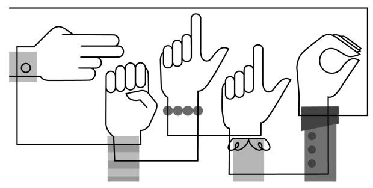

**TL;DR**

### Why ASL

As a CODA, Child of Deaf Adult, for the record I have never used that term before until now, I have an intimate understanding of the communication problems between the deaf community and the rest of population. 

ASL has continously evolved into a more expressve and inclusive language but still bears extreme limitations when trying to communicate with those outside of the language. The deaf community constantly becomes siloed within their own groups and naturally have limitations in handling simple day to day task i.e. calling their phone provider to dispute or ask questions on their bill, call a doctor for an appointment, calling any customer service line, and countless other scenarios that I have personally experienced. A task that would take a hearing person 20-30 minutes can take a deaf person 2-3X longer, if they are not hung-up on because the business believes it's fraud. 

There are many issues in todays system of communication between the deaf and non-deaf, my goal is remove some of those barriers by developing a real-time ASL interpreter of not just static ASL images but also using computer vision to display text or voice while a person signs directly with someone on other end of the line.

Thanks to COVID-19 there has been an immediate acceleration of the adoption of video as a communication tool. No longer is it seen as a luxury form of communcation. With that in mind, I believe now is a great time to bridge the gap between these two communities and develop the tools necessary for the deaf community. 

### What is American Sign Language (ASL)?

A complete guide to the definition can be found [here](https://www.nidcd.nih.gov/health/american-sign-language) by the NIDCD:

**Some important points:**
* ASL is a natural language that has some linguistic properties as spoken languages.
* Expressed by movements of hands and face, the same sign can have unique meaning by emphasis on face and/or hand movement. 
* Primary language of North American deaf and hard of hearing. 
* ASL is not universal
* Contains all the fundamental features of language, with its own rules for pronunciation, word formation, and word order.

**Interesting things to know:**
* English speakers may ask a question by raising the pitch of their voices and by adjusting word order; ASL users ask a question by raising their eyebrows, widening their eyes, and tilting their bodies forward.
* ASL has regional variations in the rhythm of signing, pronunciation, slang, and signs used. Other sociological factors, including age and gender, can affect ASL usage and contribute to its variety, just as with spoken languages.

## The Tech

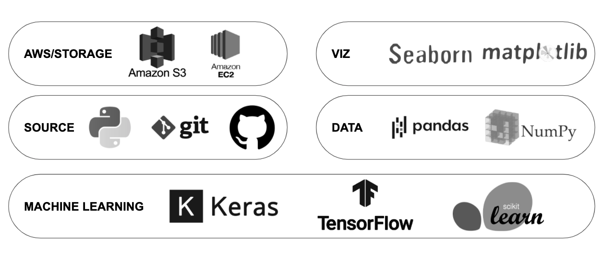

## The Data
The data was acquired through open-source repos from [GitHub](https://github.com/mjk188/ASL-Translator). 
From this repo, I acquired **7470** images with **24** classes to predict.

Using the python os library, I automated the data structuring to create a train, validation, and test directory for all my data. This follows the requirements for Keras API when training and testing your models. The directories took the following format. 

 - 7470 files
 - 24 classes
    - train set (5977 files)
        - 24 classes
    - valid set (746 files)
        - 24 classes
    - test set (747 files)
        - 24 classes

The scope of this phase was to predict classes from static images, for this reason, 2 of the letters from the alphabet were dropped since they require movement to sign (J, Z). This will be addressed in later iterations. 

Pulling a random sampling from our A Class train set, we see our images are in color (3-channel rgb):
Each image takes the shape of 200 x 200x 3. 

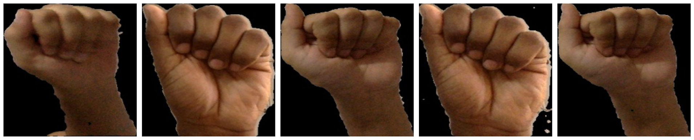

After inspecting the majority of the dataset, I identified images displaying very similar form, lighting, and hand positioning. This raised some intial concerns about the possibility of overfitting my models once I began training. Aside from these concerns, several images were miss labeled and removed. This accounted for approximately 20 images with little concern to overall performance of the model. 

Once the file directory was in order the next step was to being data preprocessing and transformation. Color is not considered an important feature for predictive accuracy for this phase, and so, the first step was to convery all images in real-time to grayscale. Also, we resized and rescaled all the images, 100 x 100 and 1/255, respectively. 

The purpose for these decisions are normally to see how light we can train our models by passing in less "information", decreasing the complexity/work load of the model. As I iterate through theses processes, I can increase the information in attempts to increase predictive ability, if necessary. 

**INSERT EXPLANATION: What do I mean by light? Display the differnce of 1 images that is "complex" vs "light".**

Another extremely useful tool within the Tensorflow.Keras API is the ability to generate synthetic data with the `ImageDataGenerator()`. This allows me to create changes in my images that can naturally take place within the real world. The basic hyperparameters used for my data augmentation are as follows:

* Random image rotation with range limit of 10 degrees.
* Shifted the image on X-axis (width) by a limit of 5%.
* Shifted the image on Y-axis (height) by a limit of 5%.
* Zooming image by limit of 5%

A sample of the resulting transformations:

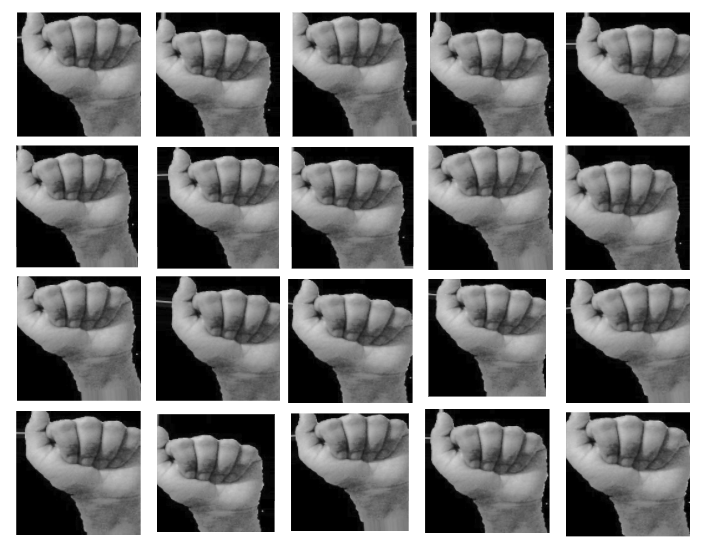

## Results

### Init_model:

Using `keras.models.Sequential()` and data preprocessed to grayscale, resizing, and rescaling but **not** augmented, I trained my **first** model with 2 Conv2D hidden layers. 

See `initial_model.py` for complete details of the model. 

### Confusion Matrix:
The initial results of an **~98%** prediction accuracy were surprising given the simplicity of the CNN model. Upon closer inspection we can see the model struggles to classify classes:

A, E, M, N, S, & T

These results are not surprising as all of these letters have very similar edge/hand structure, with the exception of the positioning of thumb, index, or middle finger. These changes are very slight and can be easily misclassified given too small a dataset. 

### Sandbox_model:

Using `keras.models.Sequential()` and data transformed with grayscale, resizing, and rescaling and augmented, I trained my **second** model with 2 Conv2D hidden layers. 

See `sandbox_model.py` for complete details of the model. 

### Confusion Matrix:
The second model suffered in predictive ability after training with the additional synthetic data. Model accuracy dropped by 4% to **94%**. The more synthetic data I fed the model the lower it's predictive abilities. 

These results are a clear indication of our first model overfitting to our training data and confirming the initial concerns addressed above. Where data diversity seemed very minimal. 

In this model, we see similar missclassfied classes, with sharp decrease in S & T as well as M & N. 

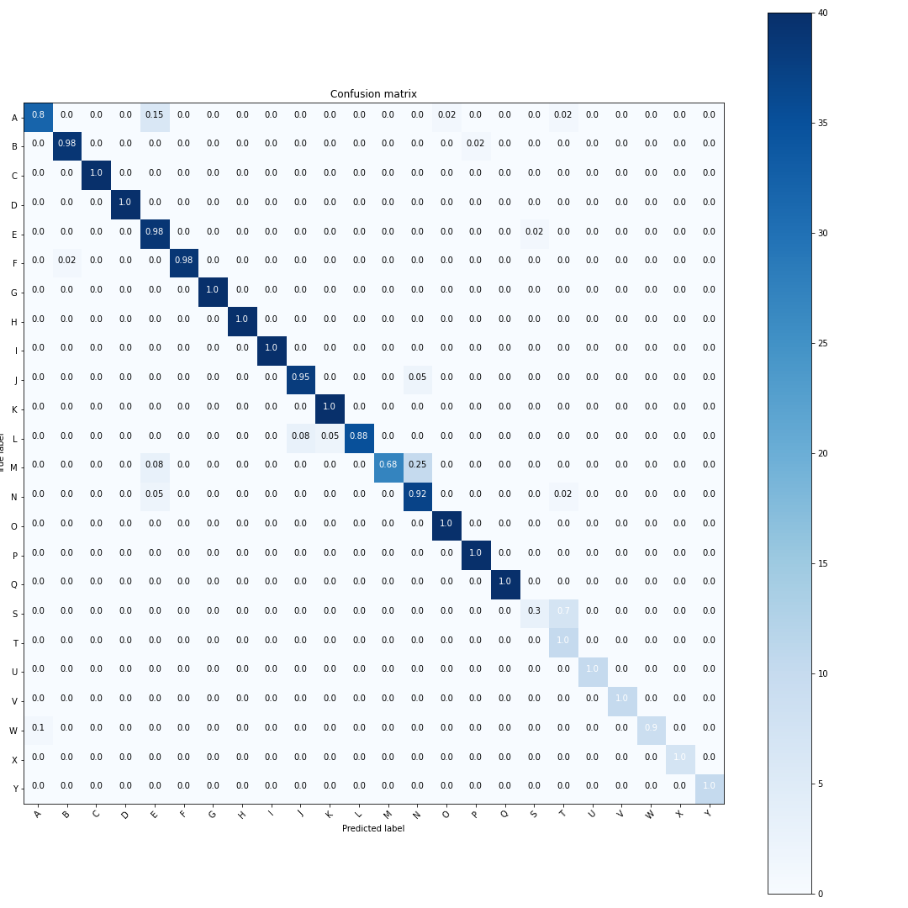

#### Sample of predictions

Here we can see a sub sample of ASL signs that were missclassified.

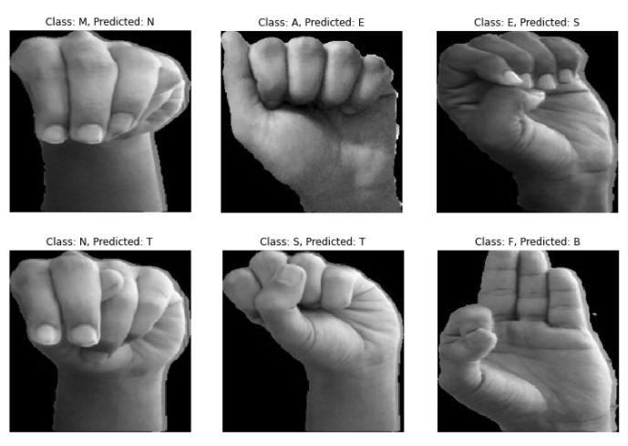

## What's next...
- [x] Collect different datasets/more complex
    - [x] Collect more complex dataset 
    - [ ] Static images that contain person in image
    - [x] Video dataset (MSFT ASL Data) 
- [ ] Train new more complex CNN models with different data
- [ ] Become familiar and develop object detection models 
- [ ] Develop independent data collection
    - [ ] develop external site and/or app to share with close friends and family to have them collect new data based off displayed words and have a gamification process of the training.
    - [ ] word shown on screen, person signs the word, can do as many of these as they'd like. 
    - [ ] data validate: option to validate others signs. 
    - [ ] create a positive feedback loop in which data fed in allows user to gain incentives. 
- [ ] Understand edge computing or train remote model and sent predictions back (i.e. google keyboard)
- [ ] Search for people that would like to contribute

<!--

** A COUPLE SAMPLES OF THE DATA**  
 
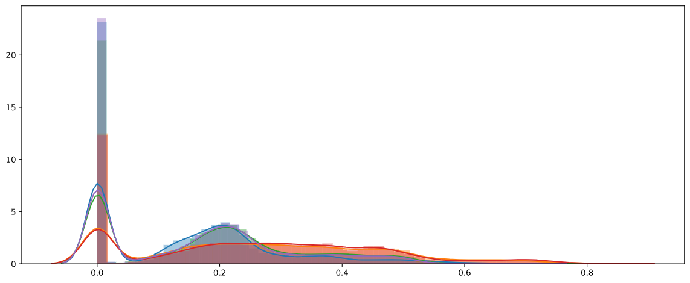 

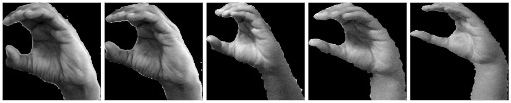 
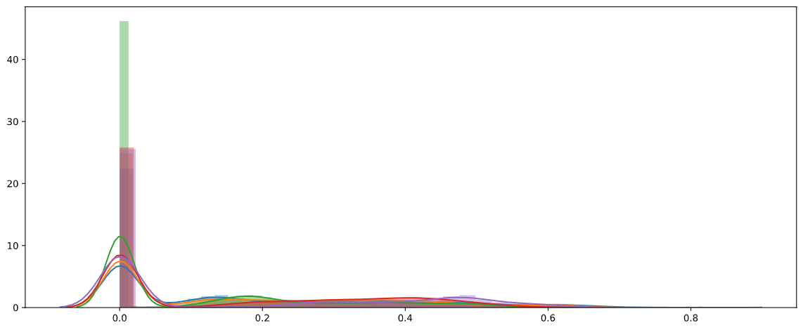 

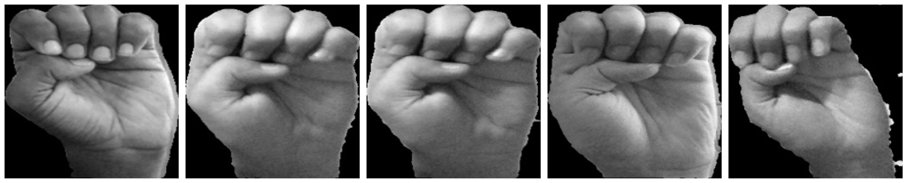 
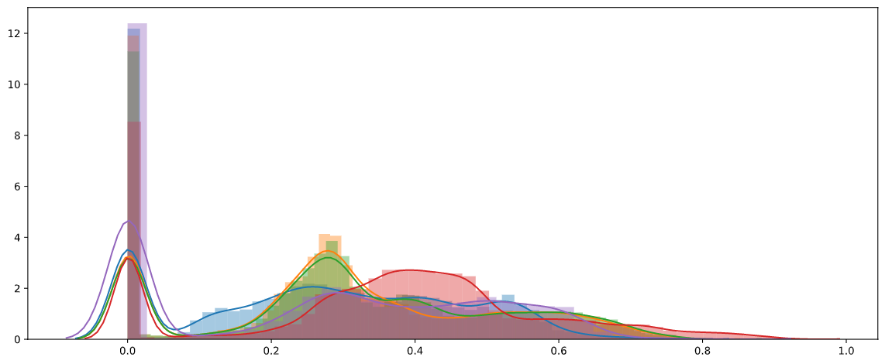 

 
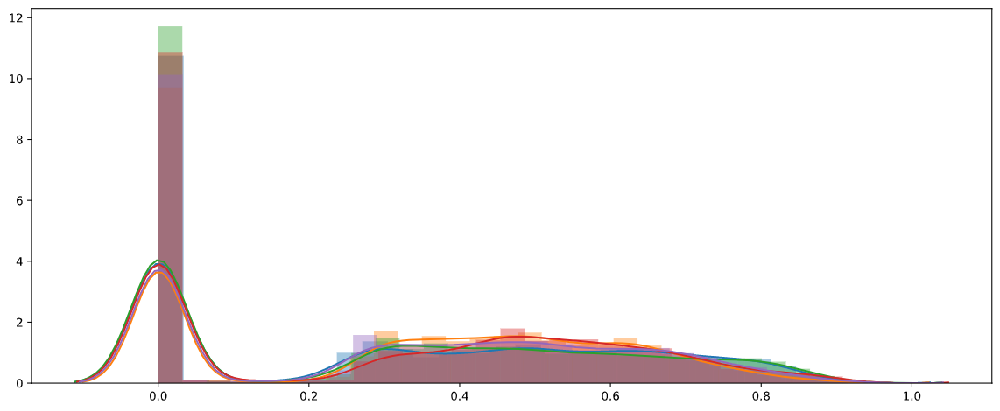 

 
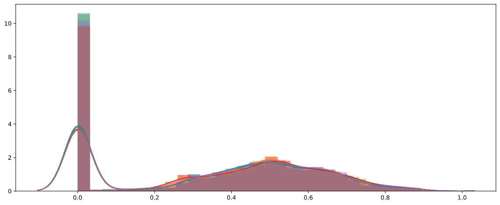 

#### Predict the letter of an image in American Sign Language (ASL)
**Prediction type:** Categorical 
**Data type:** Stationary/Images 
**Source:** Open source sites with ASL images already populated (GitHub), myself, and google images. Already have a large dataset from Microsoft from an ASL project they started in 2019.  
**Observations/features:** Data would include images of all 26 letters in alphabet from A-Z (some letters like j & z require movement). Ideally have 10 images of each letter with different backgrounds to train model.

**Summary:** Using the features provide within the data described above, using Neural Nets/Image Processing predict what letter of the alphabet is displayed in the image. Being raised by deaf parents I have an intimate relationship with the need for ASL to be more interpretable for the masses. This project will be broken down into distinct phases intended to tackle real-world issues for the deaf community. This phase will focus on developing a basic model that accurately predicts what letter of the alphabet a person is signing.

Project will be split into several phases:

**Phase I:** Collect static images of alphabet, create CNN/RFC models, train, evaluate, and test models on static images. - Capstone 2.

**Phase II:** create CNN model on non static images, train, evaluate, and test models.

**Phase III:** develop external site and/or app to share with close friends and family to have them collect new data based off displayed words and have a gamification process of the training.

**Phase IV:** TBD

data collect: word shown on screen, person signs the word, can do as many of these as they'd like.
data validate: option to validate others signs. 

create a positive feedback loop in which data fed in allows user to gain incentives. 

