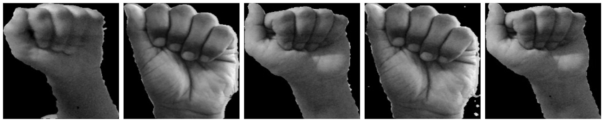

# The ASL Project
Applying machine learning techniques and convolutional neural nets to classify images of the American Sign Language (ASL) alphabet. This project contains several phases with long-term goals for real-world deployment. The intent is to have each subsequent phase build upon the previous phase. 

**TL;DR**

## Why ASL

As a CODA, Child of Deaf Adult, for the record I have never used that term before until now, I have an intimate understanding of the communication problems between the deaf community and the rest of population. 

ASL has continously evolved into a more expressve and inclusive language but still bears extreme limitations when trying to communicate with those outside of the language. The deaf community constantly becomes siloed within their own groups and naturally have limitations in handling simple day to day task i.e. calling their phone provider to dispute or ask questions on their bill, call a doctor for an appointment, calling any customer service line, and countless other scenarios that I have personally experienced. A task that would take a hearing person 20-30 minutes can take a deaf person 2-3X longer, if they are not hung-up on because the business believes it's fraud. 

There are many issues in todays system of communication between the deaf and non-deaf, my goal is remove some of those barriers by developing a real-time ASL interpreter of not just static ASL images but also using computer vision to display text or voice while a person signs directly with someone on other end of the line.

Thanks to COVID-19 there has been an immediate acceleration of the adoption of video as a communication tool. No longer is it seen as a luxury form of communcation. With that in mind, I believe now is a great time to bridge the gap between these two communities and develop the tools necessary for the deaf community. 

## The Data

 - 7470 files
 - 24 classes
    - train set
        - 5977 files
    - valid set
        - 746 files
    - test set
        - 747 files

** A COUPLE SAMPLES OF THE DATA**  
 
 

 
 

 
 

 
 

 
 

#### Predict the letter of an image in American Sign Language (ASL)
**Prediction type:** Categorical 
**Data type:** Stationary/Images 
**Source:** Open source sites with ASL images already populated (GitHub), myself, and google images. Already have a large dataset from Microsoft from an ASL project they started in 2019.  
**Observations/features:** Data would include images of all 26 letters in alphabet from A-Z (some letters like j & z require movement). Ideally have 10 images of each letter with different backgrounds to train model.

**Summary:** Using the features provide within the data described above, using Neural Nets/Image Processing predict what letter of the alphabet is displayed in the image. Being raised by deaf parents I have an intimate relationship with the need for ASL to be more interpretable for the masses. This project will be broken down into distinct phases intended to tackle real-world issues for the deaf community. This phase will focus on developing a basic model that accurately predicts what letter of the alphabet a person is signing.

Project will be split into several phases:

**Phase I:** Collect static images of alphabet, create CNN/RFC models, train, evaluate, and test models on static images. - Capstone 2.

**Phase II:** create CNN model on non static images, train, evaluate, and test models.

**Phase III:** develop external site and/or app to share with close friends and family to have them collect new data based off displayed words and have a gamification process of the training.

**Phase IV:** TBD

data collect: word shown on screen, person signs the word, can do as many of these as they'd like.
data validate: option to validate others signs. 

create a positive feedback loop in which data fed in allows user to gain incentives. 

